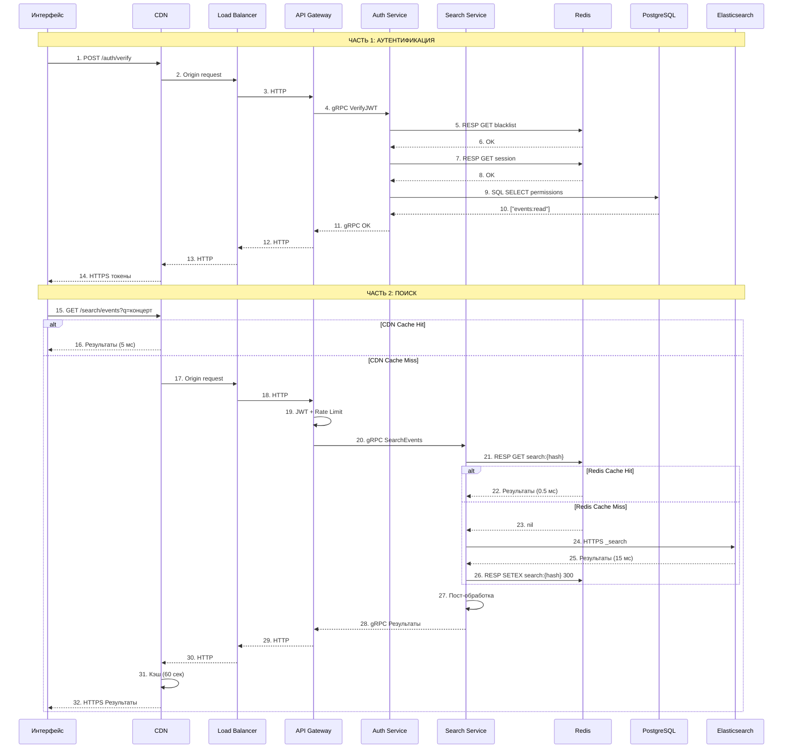
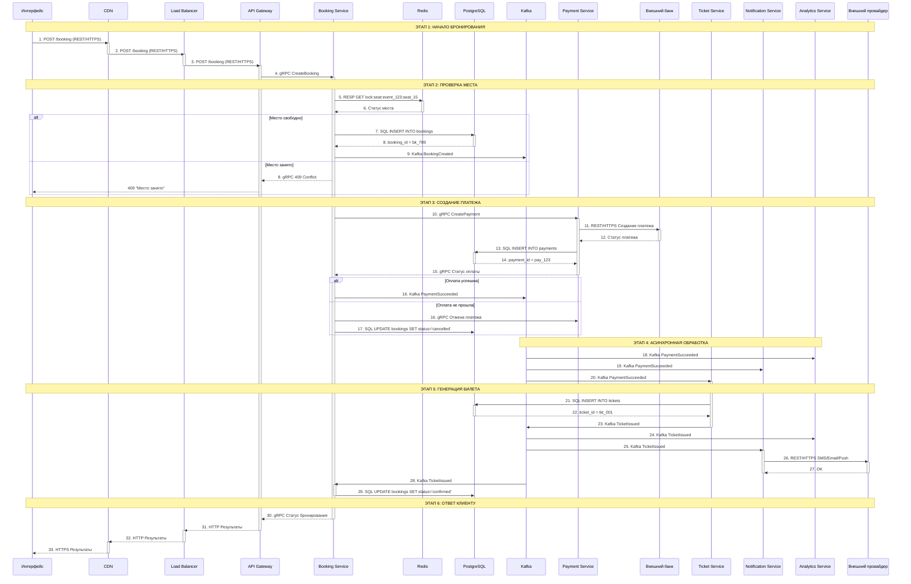

# 5. Взаимодействие
### 5.1 Схема взаимодействия сервисов и выбор протоколов

Уточнение - Топики Kafka разделены по доменам:
1. Данные бронирования (booking)
- Источник - Сервис бронирования
- Потребители - Сервис уведомлений, Сервис аналитики, Сервис билетов, Сервис поиска

2. Данные мероприятия (event)
- Источник - Сервис мероприятий
- Потребители - Сервис уведомлений, Сервис аналитики, Сервис билетов, Сервис бронирования, Сервис поиска

3. Данные билетов (ticket)
- Источник - Сервис билетов
- Потребители - Сервис уведомлений, Сервис аналитики, Сервис бронирования, Сервис поиска

| Процесс                                                                                       | Сервис 1                                                    | Сервис 2                                                                                          | Протокол                                    | Почему выбран                                                                                                                                                 |
|-----------------------------------------------------------------------------------------------|-------------------------------------------------------------|---------------------------------------------------------------------------------------------------|---------------------------------------------|---------------------------------------------------------------------------------------------------------------------------------------------------------------|
| Работа пользователя  с системой                                                            | WEB-приложение клиента/ организатора                        | CDN                                                                                               | REST API (HTTP 2/ JSON)                     | Двухнаправленное взаимодействие  с пользователем в режиме реального времени                                                                             |
| Работа пользователя  с системой                                                            | Мобильное приложение (IOS/ Android) клиента/организатора | CDN                                                                                               | REST API (HTTP 2/ JSON)                     | Двухнаправленное взаимодействие  с пользователем в режиме реального времени.  Взаимодействие через REST и CDN  поможет кэшировать данные             |
| Работа пользователя  с системой                                                            | CDN                                                         | API Gateway/ Load Balancer                                                                        | REST API (HTTP 2/ JSON)                     | Двухнаправленное взаимодействие - через запрос/ответ с пользователем                                                                                       |
| Проверка доступов                                                                             | API Gateway/ Load Balancer                                  | Сервис авторизации  и аутентификации (Auth Service)                                            | REST API (HTTP 2/ JSON)                     | Двухнаправленное взаимодействие - через запрос/ответ  (проверка прав доступа пользователя)                                                              |
| Проверка доступов                                                                             | Сервис авторизации и аутентификации (Auth Service)       | Сервис управления пользовательскими данными  (User Profile Service)                            | gRPC (request/response) HTTP/2           | Двухнаправленное взаимодействие  внутри системы - через запрос/ответ Выбран gRPC для высокой производительности (проверка прав доступа пользователя) |
| Работа над данными мероприятий                                                                | API Gateway                                                 | Сервис мероприятий (Event Service)                                                                | gRPC (request/response) HTTP/2           | Двухнаправленное взаимодействие  внутри системы - через запрос/ответ Выбран gRPC для высокой производительности                                         |
| Работа над данными мероприятий - получение координат и адреса площадки  для мероприятия | Сервис мероприятий (Event Service)                          | Сервис поиска (Search Service)                                                                    | gRPC (request/response) HTTP/2           | Двухнаправленное взаимодействие  внутри системы - через запрос/ответ Выбран gRPC для высокой производительности                                         |
| Поиск в системе                                                                               | API Gateway                                                 | Сервис поиска (Search Service)                                                                    | gRPC (request/response) HTTP/2           | Двухнаправленное взаимодействие  внутри системы - через запрос/ответ Выбран gRPC для высокой производительности                                         |
| Поиск в системе                                                                               | Сервис поиска (Search Service)                              | Elasticsearch                                                                                     | HTTPS (JSON)                                |                                                                                                                                                               |
| Бронирование                                                                                  | API Gateway                                                 | Сервис бронирования (Booking service)                                                             | gRPC (request/response) HTTP/2           | Двухнаправленное взаимодействие  внутри системы - через запрос/ответ Выбран gRPC для высокой производительности                                         |
| Бронирование                                                                                  | Сервис бронирования (Booking service)                       | Сервис уведомлений  Сервис аналитики Сервис билетов Сервис поиска                        | async pub/sub, очереди Kafka Protobuf    | Публикация данных асинхронно  для поддержки пиковой нагрузки  в 10000 RPS Сервис не блокируется  ожиданием ответа от получателя                   |
| Оплата                                                                                        | Сервис бронирования  (Booking service)                   | Сервис оплаты (Payment Service)                                                                | gRPC (request/response) HTTP/2           | Двухнаправленное взаимодействие  внутри системы - через запрос/ответ Выбран gRPC для высокой производительности                                         |
| Работа с билетами                                                                             | Сервис билетов                                              | Сервис уведомлений Сервис аналитики Сервис бронирования Сервис поиска                    | async pub/sub, очереди Kafka Protobuf    | Публикация данных асинхронно  для поддержки пиковой нагрузки  в 10000 RPS Сервис не блокируется  ожиданием ответа от получателя                   |
| Публикация данных о мероприятиях                                                              | Сервис мероприятий (Event Service)                          | Сервис уведомлений Сервис аналитики Сервис билетов  Сервис бронирования Сервис поиска | async pub/sub, очереди Kafka Protobuf    | Публикация данных асинхронно  для поддержки пиковой нагрузки  в 10000 RPS Сервис не блокируется  ожиданием ответа от получателя                   |
| Получение данных адресов и координат                                                          | Сервис геолокации                                           | Внешняя система Яндекс.Карты                                                                      | REST API Яндекс.Карт  (HTTP 2/ JSON)     | Внутренний сервис подключается  к внешней системе через опубликованный  открытый публичный контракт                                                     |
| Оплата                                                                                        | Сервис оплаты                                               | Внешняя системы оплаты  (банк-клиент)                                                          | REST API внешней системы  (HTTP 2/ JSON) | Внутренний сервис подключается  к внешней системе через опубликованный  открытый публичный контракт                                                     |
| Уведомления о бронировании/ билетах                                                           | Сервис уведомлений                                          | Внешний провайдер уведомлений  (смс/емайл)                                                     | REST API внешней системы  (HTTP 2/ JSON) | Внутренний сервис подключается  к внешней системе через опубликованный  открытый публичный контракт                                                     |
| Получение/ передача  данных о мероприятиях                                                 | Сервис управления мероприятиями                             | Внешний сервис партнера мероприятий (площадок)                                                    | REST API внешней системы  (HTTP 2/ JSON) | Внутренний сервис подключается  к внешней системе через опубликованный  открытый публичный контракт                                                     |

### 5.2 Ключевые API (3-5 контрактов)

##### Атрибутный состав сущности Бронирования
| Номер | Атрибут           | Описание атрибута                       | Тип    | Обязательность                                            | Допустимые значения                                                                                                                                                                                                                                                                                                                                     |
|-------|-------------------|-----------------------------------------|--------|-----------------------------------------------------------|---------------------------------------------------------------------------------------------------------------------------------------------------------------------------------------------------------------------------------------------------------------------------------------------------------------------------------------------------------|
| 1     | booking_id        | GUID бронирования                       | uuid   | 1..1                                                      | Уникальный идентификатор бронирования                                                                                                                                                                                                                                                                                                                   |
| 2     | booking_status    | Статус бронирования                     | int    | 0..1 Обязателен при изменении  статуса бронирования | 1- created - создано и ожидает оплаты 2 - paid - оплачено 3 - confirmed - подтверждено и ожидает мероприятия 4 - completed - выполнено (мероприятие прошло) 5 - expired - время ожидание оплаты истекло, бронирование места отменено 6 - failed - оплата не прошла, бронирование места отменено 7 - cancelled - бронирование отменено |
| 3     | timestamp_bookong | Дата и время операции над бронированием | date   | 1..1                                                      |                                                                                                                                                                                                                                                                                                                                                         |
| 4     | event_id          | GUID мероприятия                        | uuid   | 1..1                                                      | Связь с таблицей Event                                                                                                                                                                                                                                                                                                                                  |
| 5     | client_id         | GUID клиента                            | uuid   | 1..1                                                      | Связь с таблицей Client                                                                                                                                                                                                                                                                                                                                 |
| 6     | ticket_id         | Массив билетов                          | array  | 1..*                                                      | Связь с таблицей Ticket В одном бронировании может быть несколько билетов                                                                                                                                                                                                                                                                            |
| 7     | payment_id        | GUID платежа                            | uuid   | 1..1                                                      | Связь с таблицей Payment                                                                                                                                                                                                                                                                                                                                |
| 8     | comment           | Комментарий к бронированию              | string | 0..1                                                      |                                                                                                                                                                                                                                                                                                                                                         |

                                                                                                               

#### 1. Метод создания бронирования
POST /api/v1/booking/create

Атрибуты запроса
| Номер | Атрибут           | Описание атрибута                       | Тип    | Обязательность | Допустимые значения                                                          |
|-------|-------------------|-----------------------------------------|--------|----------------|------------------------------------------------------------------------------|
| 1     | booking_id        | GUID бронирования                       | uuid   | 1..1           | Уникальный идентификатор бронирования                                        |
| 3     | timestamp_bookong | Дата и время операции над бронированием | date   | 1..1           |                                                                              |
| 4     | event_id          | GUID мероприятия                        | uuid   | 1..1           | Связь с таблицей Event                                                       |
| 5     | client_id         | GUID клиента                            | uuid   | 1..1           | Связь с таблицей Client                                                      |
| 6     | ticket_id         | Массив билетов                          | array  | 1..*           | Связь с таблицей Ticket В одном бронировании может быть несколько билетов |
| 7     | payment_id        | GUID платежа                            | uuid   | 1..1           | Связь с таблицей Payment                                                     |
| 8     | comment           | Комментарий к бронированию              | string | 0..1           |                                                                              |

Ответы
| Ответ            | Описание                                                                                                          |
|------------------|-------------------------------------------------------------------------------------------------------------------|
| 201 Created      | Бронь создана В ответ передается booking_id                                                                    |
| 200 OK           | Если уже существует такой же booking_id, бронирование уже создано                                                 |
| 400 Bad Request  | Введены неверные данные (отсутствуют обязательные поля, или неверный формат guid,  или введен неверный статус) |
| 401 Unauthorized | Пользователь не авторизован                                                                                       |
| 403 Forbidden    | Доступа на создание бронирования нет                                                                              |
| 404 Not Found    | Мероприятие не найдено                                                                                            |
| 409 Conflict     | Ошибки с покупкой билета на место (занято, недоступно)                                                            |

#### 2. Метод изменения данных бронирования
POST /api/v1/booking/{id}/update

Атрибуты запроса
| Номер | Атрибут    | Описание атрибута          | Тип    | Обязательность | Допустимые значения                                                          |
|-------|------------|----------------------------|--------|----------------|------------------------------------------------------------------------------|
| 1     | booking_id        | GUID бронирования                       | uuid   | 1..1           | Уникальный идентификатор бронирования                    |
| 2     | event_id   | GUID мероприятия           | uuid   | 0..1           | Связь с таблицей Event                                                       |
| 3     | client_id  | GUID клиента               | uuid   | 0..1           | Связь с таблицей Client                                                      |
| 4     | ticket_id  | Массив билетов             | array  | 0..*           | Связь с таблицей Ticket В одном бронировании может быть несколько билетов |
| 5     | payment_id | GUID платежа               | uuid   | 0..1           | Связь с таблицей Payment                                                     |
| 6     | comment    | Комментарий к бронированию | string | 0..1           |                                                                              |

Ответы
| Ответ            | Описание                                                                                                          |
|------------------|-------------------------------------------------------------------------------------------------------------------|
| 200 OK           | Изменение применено. В ответ передается booking_id, timestamp_booking операции                                              |
| 400 Bad Request  | Введены неверные данные (отсутствуют обязательные поля, или неверный формат guid,  или введен неверный статус) |
| 401 Unauthorized | Пользователь не авторизован                                                                                       |
| 403 Forbidden    | Доступа на создание бронирования нет                                                                              |
| 404 Not Found    | Мероприятие не найдено                                                                                            |
| 409 Conflict     | Ошибки с покупкой билета на место (занято, недоступно)                                                            |

#### 3. Метод запрос статуса бронирования
GET /api/v1/booking/{id}/status

Атрибуты запроса
| Номер | Атрибут           | Описание атрибута                       | Тип    | Обязательность                                            | Допустимые значения                                                                                                                                                                                                                                                                                                                                     |
|-------|-------------------|-----------------------------------------|--------|-----------------------------------------------------------|---------------------------------------------------------------------------------------------------------------------------------------------------------------------------------------------------------------------------------------------------------------------------------------------------------------------------------------------------------|
| 1     | booking_id        | GUID бронирования                       | uuid   | 1..1                                                      | Уникальный идентификатор бронирования                                                                                                                                                                                                                                                                                                                   |

Ответы
| Ответ            | Описание                                                                                                          |
|------------------|-------------------------------------------------------------------------------------------------------------------|
| 200 OK           | Успешно. В ответ передается: booking_id,  booking_status,  event_id,  client_id,  ticket_id,  payment_id,  comment,  timestamp_booking операции                                              |
| 400 Bad Request  | Введены неверные данные (отсутствуют обязательные поля, или неверный формат guid,  или введен неверный статус) |
| 401 Unauthorized | Пользователь не авторизован                                                                                       |
| 403 Forbidden    | Доступа на создание бронирования нет                                                                              |
| 404 Not Found    | Мероприятие не найдено                                                                                            |
| 409 Conflict     | Ошибки с покупкой билета на место (занято, недоступно)                                                            |

#### 4. Методы изменения статусов бронирования
2 - paid - оплачено

3 - confirmed - подтверждено и ожидает мероприятия

4 - completed - выполнено (мероприятие прошло)

5 - expired - время ожидание оплаты истекло, бронирование места отменено

6 - failed - оплата не прошла, бронирование места отменено

7 - cancelled - бронирование отменено

##### 4.1 Метод оплаты бронирования**
POST /api/v1/booking/{id}/pay
| Номер | Атрибут           | Описание атрибута                       | Тип    | Обязательность                                            | Допустимые значения                                                                                                                                                                                                                                                                                                                                     |
|-------|-------------------|-----------------------------------------|--------|-----------------------------------------------------------|---------------------------------------------------------------------------------------------------------------------------------------------------------------------------------------------------------------------------------------------------------------------------------------------------------------------------------------------------------|
| 1     | booking_id        | GUID бронирования                       | uuid   | 1..1                                                      | Уникальный идентификатор бронирования                                                                                                                                                                                                                                                                                                                   |

Ответы
| Ответ            | Описание                                                                                                          |
|------------------|-------------------------------------------------------------------------------------------------------------------|
| 200 OK           | Успешно. В ответ передается: booking_id,  booking_status (paid),  payment_id,  timestamp_booking (дата и время оплаты)    |
| 400 Bad Request  | Введены неверные данные (отсутствуют обязательные поля, или неверный формат guid,  или введен неверный статус) |
| 401 Unauthorized | Пользователь не авторизован                                                                                       |
| 403 Forbidden    | Доступа на создание бронирования нет                                                                              |
| 404 Not Found    | Мероприятие не найдено                                                                                            |
| 409 Conflict     | Ошибки с покупкой билета на место (занято, недоступно)                                                            |

##### 4.2 Метод подтверждения бронирования
POST /booking/{id}/confirm
| Номер | Атрибут           | Описание атрибута                       | Тип    | Обязательность                                            | Допустимые значения                                                                                                                                                                                                                                                                                                                                     |
|-------|-------------------|-----------------------------------------|--------|-----------------------------------------------------------|---------------------------------------------------------------------------------------------------------------------------------------------------------------------------------------------------------------------------------------------------------------------------------------------------------------------------------------------------------|
| 1     | booking_id        | GUID бронирования                       | uuid   | 1..1                                                      | Уникальный идентификатор бронирования                                                                                                                                                                                                                                                                                                                   |

Ответы
| Ответ            | Описание                                                                                                          |
|------------------|-------------------------------------------------------------------------------------------------------------------|
| 200 OK           | Успешно. В ответ передается: booking_id,  booking_status (confirm),  timestamp_booking (дата и время подтверждения бронирования)|
| 400 Bad Request  | Введены неверные данные (отсутствуют обязательные поля, или неверный формат guid,  или введен неверный статус) |
| 401 Unauthorized | Пользователь не авторизован                                                                                       |
| 403 Forbidden    | Доступа на создание бронирования нет                                                                              |
| 404 Not Found    | Мероприятие не найдено                                                                                            |
| 409 Conflict     | Ошибки с покупкой билета на место (занято, недоступно)                                                            |

##### 4.3 Метод исполнения бронирования
POST /booking/{id}/completed
| Номер | Атрибут           | Описание атрибута                       | Тип    | Обязательность                                            | Допустимые значения                                                                                                                                                                                                                                                                                                                                     |
|-------|-------------------|-----------------------------------------|--------|-----------------------------------------------------------|---------------------------------------------------------------------------------------------------------------------------------------------------------------------------------------------------------------------------------------------------------------------------------------------------------------------------------------------------------|
| 1     | booking_id        | GUID бронирования                       | uuid   | 1..1                                                      | Уникальный идентификатор бронирования                                                                                                                                                                                                                                                                                                                   |

Ответы
| Ответ            | Описание                                                                                                          |
|------------------|-------------------------------------------------------------------------------------------------------------------|
| 200 OK           | Успешно. В ответ передается: booking_id,  booking_status (completed),  timestamp_booking (дата и время исполнения бронирования completed)|
| 400 Bad Request  | Введены неверные данные (отсутствуют обязательные поля, или неверный формат guid,  или введен неверный статус) |
| 401 Unauthorized | Пользователь не авторизован                                                                                       |
| 403 Forbidden    | Доступа на создание бронирования нет                                                                              |
| 404 Not Found    | Мероприятие не найдено                                                                                            |
| 409 Conflict     | Ошибки с покупкой билета на место (занято, недоступно)                                                            |

##### 4.4 Метод выставления истечения времени бронирования
POST /booking/{id}/expired
| Номер | Атрибут           | Описание атрибута                       | Тип    | Обязательность                                            | Допустимые значения                                                                                                                                                                                                                                                                                                                                     |
|-------|-------------------|-----------------------------------------|--------|-----------------------------------------------------------|---------------------------------------------------------------------------------------------------------------------------------------------------------------------------------------------------------------------------------------------------------------------------------------------------------------------------------------------------------|
| 1     | booking_id        | GUID бронирования                       | uuid   | 1..1                                                      | Уникальный идентификатор бронирования                                                                                                                                                                                                                                                                                                                   |

Ответы
| Ответ            | Описание                                                                                                          |
|------------------|-------------------------------------------------------------------------------------------------------------------|
| 200 OK           | Успешно. В ответ передается: booking_id,  booking_status (expired),  timestamp_booking (дата и время expired)|
| 400 Bad Request  | Введены неверные данные (отсутствуют обязательные поля, или неверный формат guid,  или введен неверный статус) |
| 401 Unauthorized | Пользователь не авторизован                                                                                       |
| 403 Forbidden    | Доступа на создание бронирования нет                                                                              |
| 404 Not Found    | Мероприятие не найдено                                                                                            |
| 409 Conflict     | Ошибки с покупкой билета на место (занято, недоступно)                                                            |

##### 4.5 Метод возврата бронирования
POST /booking/{id}/failed
| Номер | Атрибут           | Описание атрибута                       | Тип    | Обязательность                                            | Допустимые значения                                                                                                                                                                                                                                                                                                                                     |
|-------|-------------------|-----------------------------------------|--------|-----------------------------------------------------------|---------------------------------------------------------------------------------------------------------------------------------------------------------------------------------------------------------------------------------------------------------------------------------------------------------------------------------------------------------|
| 1     | booking_id        | GUID бронирования                       | uuid   | 1..1                                                      | Уникальный идентификатор бронирования                                                                                                                                                                                                                                                                                                                   |

Ответы
| Ответ            | Описание                                                                                                          |
|------------------|-------------------------------------------------------------------------------------------------------------------|
| 200 OK           | Успешно. В ответ передается: booking_id,  booking_status (failed),  timestamp_booking (дата и время failed)|
| 400 Bad Request  | Введены неверные данные (отсутствуют обязательные поля, или неверный формат guid,  или введен неверный статус) |
| 401 Unauthorized | Пользователь не авторизован                                                                                       |
| 403 Forbidden    | Доступа на создание бронирования нет                                                                              |
| 404 Not Found    | Мероприятие не найдено                                                                                            |
| 409 Conflict     | Ошибки с покупкой билета на место (занято, недоступно)                                                            |

##### 4.6  Метод отмены бронирования
POST /booking/{id}/cancelled
| Номер | Атрибут           | Описание атрибута                       | Тип    | Обязательность                                            | Допустимые значения                                                                                                                                                                                                                                                                                                                                     |
|-------|-------------------|-----------------------------------------|--------|-----------------------------------------------------------|---------------------------------------------------------------------------------------------------------------------------------------------------------------------------------------------------------------------------------------------------------------------------------------------------------------------------------------------------------|
| 1     | booking_id        | GUID бронирования                       | uuid   | 1..1                                                      | Уникальный идентификатор бронирования                                                                                                                                                                                                                                                                                                                   |

Ответы
| Ответ            | Описание                                                                                                          |
|------------------|-------------------------------------------------------------------------------------------------------------------|
| 200 OK           | Успешно. В ответ передается: booking_id,  booking_status (cancelled),  timestamp_booking (дата и время cancelled)|
| 400 Bad Request  | Введены неверные данные (отсутствуют обязательные поля, или неверный формат guid,  или введен неверный статус) |
| 401 Unauthorized | Пользователь не авторизован                                                                                       |
| 403 Forbidden    | Доступа на создание бронирования нет                                                                              |
| 404 Not Found    | Мероприятие не найдено                                                                                            |
| 409 Conflict     | Ошибки с покупкой билета на место (занято, недоступно)                                                            |

### 5.3 Схемы взаимодействия сервисов
##### Поиск ближайших мероприятий и бронирование билетов
1. Клиент открывает сайт/мобильное приложение и начинает поиск ближайших мероприятий
2. Проверка доступа пользователя, его авторизация и аутентификация
   1. **Интерфейс → CDN**: REST/HTTPS (возвращает данные, если есть в кэш)
   2. **CDN → Load Balancer**: Cache Miss (если данных в кэш CDN нет, запрос данных)
   3. **Load Balancer → API Gateway**: REST/HTTP маршрутизация запроса к API 
   4. **API Gateway → Auth Service**: gRPC (запрос данных токена доступа)
   5. **Auth Service → PostgreSQL**: SQL (запрос данных токена доступа)
   6. **Auth Service → Redis**: RESP (запрос данных токена доступа из кэш)
   7. **Auth Service → API Gateway**: gRPC (токены)
   8. **API Gateway → Load Balancer**: REST/HTTP (передача ответа данных доступа пользователя)
   9. **Load Balancer → CDN**: REST/HTTP (передача ответа данных доступа пользователя)
   10. **CDN → Интерфейс**: REST/HTTPS (токены)
3. Авторизованный клиент с доступом ищет ближайшие мероприятия
   1. **Интерфейс → CDN**: GET запрос на данные мероприятий (возвращает данные, если есть в кэш) с параметрами - тематика, тип мероприятия, коррдинаты пользователя
   2. **CDN → Load Balancer**: Cache Miss (если данных в кэш CDN нет, запрос данных)
   3. **Load Balancer → API Gateway**: REST/HTTP маршрутизация запроса к API с параметрами - тематика, тип мероприятия, коррдинаты пользователя
   4. **API Gateway → Search Service**: gRPC (запрос данных мероприятия у сервиса поиска, если данные есть) с параметрами - тематика, тип мероприятия, коррдинаты пользователя
   5. **Search Service → Redis**: RESP - запрос данных мероприятия из кэш, если данные есть, нужно, чтобы менее нагружать Elasticsearch
   6. **Redis → Search Service**: В ответ передаются данные мерпориятий ранее закэшированные
   7. **Search Service → Elasticsearch**: HTTPS - если данные из Redis не найдены, то запрос напрямую к Elasticsearch
   8. **Elasticsearch → Search Service**: REST/HTTP (результаты)
   9. **Search Service → Redis**: RESP (сервис поиска сохраняет данные в кэш, которые были получены из Elasticsearch)
   10. **Search Service → API Gateway**: gRPC (передача результатов поиска)
   11. **API Gateway → LB**: HTTP (передача результатов поиска)
   12. **LB → CDN**: HTTP (передача результатов поиска)
   13. **CDN → Интерфейс**: HTTPS (передача результатов поиска)

# Сценарий: Поиск ближайших мероприятий

   
4. Клиент на сайте/мобильного приложения выбирает нужный билет и нажимает кнопку для начала бронирования и покупки билета
   1. **Интерфейс → CDN**: REST/HTTPS передается запрос о бронировании, CDN получает запрос и маршрутизирует на сервер пользователя по местоположению
   2. **CDN → Load Balancer**: REST/HTTPS передается запрос о бронировании
   3. **Load Balancer → API Gateway**: REST/HTTPS передается запрос о бронировании
   4. **API Gateway → Booking service**: gRPC запрос на начало бронирования
   2. **Booking service → Redis**: RESP проверка места на доступность (если данные есть, передача ответа)
   3. **Redis → Booking service** : ответ по статусу доступности места
   4. **Booking service → PostgreSQL**: SQL - создание места и запись в БД
   5. **Booking service → топик Kafka**: брокер сообщений: публикация события о статусе создания бронирования
   6. **Booking service → Payment Service**: gRPC запрос на создание оплаты (платежа)
   7. **Payment Service → Внешняя система банка-клиента**: REST/HTTPS запрос на создание оплаты (платежа), ответ по статусу
   8. **Payment Service → PostgreSQL**: SQL - создание платежа и запись в БД
   9. **Payment Service → Booking service**: gRPC передача ответа - статуса оплаты (если неуспешно, то отмена платежа)
   10. **Booking service → топик Kafka**: брокер сообщений: публикация события о статусе оплаты бронирования
   11. **топик Kafka → Analytics Service, Notification Service, Ticket Service**: брокер сообщений: публикация события о статусе оплаты бронирования
   12. **Ticket Service → PostgreSQL**: SQL - создание билета по факту оплаты и запись в БД
   13. **Ticket Service → топик Kafka**: брокер сообщений: публикация события о статусе билета
   14. **топик Kafka → Analytics Service, Notification Service, Booking service**: брокер сообщений: публикация события о статусе билета для бронирования
   15. **Booking service → API Gateway**: gRPC запрос по статусу бронирования
   16. **API Gateway → LB**: HTTP (передача результатов бронирования)
   17. **LB → CDN**: HTTP (передача результатов бронирования)
   18. **CDN → Интерфейс**: HTTPS (передача результатов бронирования)
   19. **Notification Service → Внешний сервис провайдера для уведомлений**: REST/HTTPS передача запроса к отправке уведомления о билете (смс/емайл/пуш)

# Сценарий: Бронирование и покупка билета

