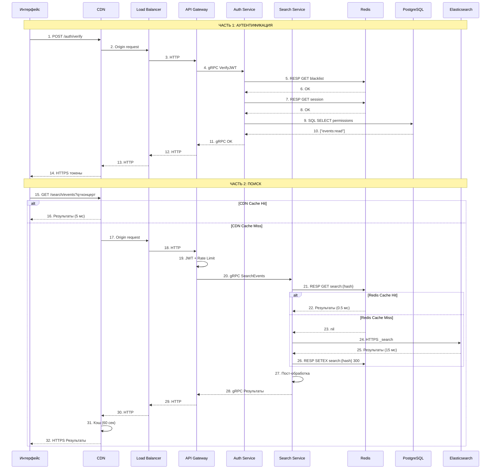
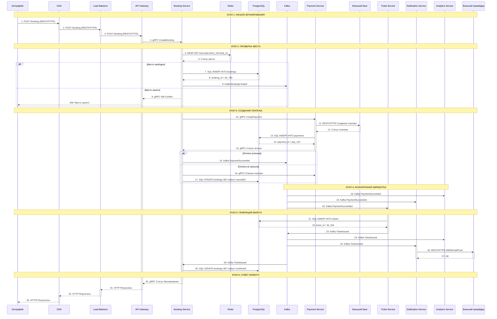

# 1. Требования и общее описание системы - Система управления мероприятиями

- Функциональные требования (scope проекта)
- Нефункциональные требования (конкретные цифры)
- Риски и ограничения
- Backlog (что не входит в scope)

### 1.1 Описание системы
Система покупки билетов на мероприятия (концерты, театры, экскурсии, выставки, кино) в городах России. Система доступна в веб-интерфейсе и в мобильном приложении.
Основные метрики и показатели DAU/MAU взяты из данных Яндекс.Афиша.

### 1.2 Основные объекты
#### Роли:
1. Клиент (Client) - пользователь, который работает в интерфейсе системы (приложения или сайта) для заказа билетов на мероприятия
2. Организатор (Partner) - пользователь, который является партнером системы и устраивает мероприятия (создает/ редактирует, а также продает билеты

#### Объекты:
1. Бронирование (Booking) - бронирование или заказ содержит в себе агрегированную информацию о мероприятии/ дате/ клиенте/ стоимости/ огранизаторе
2. Мероприятие (Event) - основной объект, содержит в себе общее описание события с площадкой, организатором, и другой метаинформацией
4. Площадка (Location) - отражает местоположение мероприятия (город, адрес, телефон, схему зала)
5. Билет (Ticket) - содержит информацию - площадка (город, адрес), дата, стоимость, площадка, данные клиента, данные организатора
6. Клиент (пользователь Client)  - роль в системе для поиска и просмотра мероприятий, покупки билетов, управления билетами в личном кабинете
7. Организатор (пользователь Partner) - роль в системе партнера для добавления и редактирования мероприятия (настройки площадки, управление билетами, установка цен)
8. Платеж (Payment) - оплата за бронирование (покупка билета)
   

### 1.3 Фунциональные требования (что должна уметь система)
#### Основные UserStory
#### 1. Как клиент, я хочу:
   - зайти на сайт или мобильное приложение системы, найти нужное мне мероприятие с возможностью поиска - по городу проведения мероприятия, по дате, по типу, по тематике или жанру
   - зайти на страницу мероприятия, выбрать себе место на схеме зала, ознакомиться с ценами и забронировать место
   - оформить бронирование/ заказ на забронированное место на площадке мероприятия и далее оплатить билет
   - отменить бронирование/ заказ - вернуть билет и получить обратно сумму
   - зайти в личный кабинет и посмотреть список своих билетов, открыть детали билета
   - получить билет на почту или в приложение с QR-кодом
   
#### 2. Как организатор, я хочу:
   - зайти в настройку мероприятия - добавить описание (дату, категорию и тематику), настроить площадку и загрузить схему зала, установить цены на билеты
   - смотреть статистику продаж (сумму выручки по мероприятиям, тематикам и категориям, количеству проданных билетов)

### 1.4 Нефункциональные требования 
1. Время отклика (latency) на поиск мероприятия (меньше 200 мс), оформление бронирования/заказа (1-2 секунды)
2. Общая пропускная способность (throughput) 300-1 000 RPS, а также в пиковые нагрузки (выходные, праздники, старты продаж) - примерно 10 000 RPS
4. Масштабируемость (Scalability) в случае роста количества пользователей, а также количества мероприятий - вертикальная (увеличение мощности и показателей серверов) и горизонтальная (увеличение количества серверов). Масштабирование может быть достигнуто при помощи шардирования (разбиение и хранение данных на разных серверах в случае увеличенного количества данных) и балансировщика между шардами
5. Доступность (SLA) - целевое 99,9%
6. Отказоустойчивость - падение одного из сервисов системы не должно останавливать процессы работы над бронированием и потерю данных. Требуется обеспечить сохранение данных при помощи репликации
7. Безопасность - шифрование, аутентификация и авторизация пользователей - клиента и партнера
8. Надежность данных - гарантированная доставка событий (например в процессе оплаты и подтверждения бронирования - оплата совершилась, бронирование должно быть принято) и индепотентность (при нажатии кнопки создать бронирование/заказ - должен быть создан только один экземпляр без дублирования)
9. Логирование и метрики - хранение логов для аудита, а также сбор технических и бизнес-метрик для дальнейшего анализа
10. Гео-распределенность и маршрутизация пользователей на ближайшие дата-центры по местоположению - использование CDN для снижения задержек и кэширования
11. Обратная совместимость взаимодействия сервисов и поддержка версионности системного API, а также интеграций с внешними системами

### 1.5 Риски и ограничения
1. Не учитывается расчет бонусов/лояльности за покупку билетов
2. Не рассматривается функциональность администрирования и роль администратора системы
3. Не входит анализ предпочтений, работаем только с теми мероприятиями, которые выбрал клиент

# 2. Концептуальная архитектура
_Схема концептуальной архитектуры (C4: Context + Container)
Описание компонентов (1-2 предложения на каждый)
Обоснование архитектурного стиля
ADR для 2-3 ключевых решений
Пользователи и внешние интеграции_

### 2.1. Описание компонентов
#### Пользовательские интерфейсы
##### 1. Пользователь - клиент (Client)
Интерфейс (Веб-версия, мобильное приложение, десктопное приложение), который должен предоставлять клиентам-пользователям услугу - возможность заказа и покупки билетов на мероприятия в системе

##### 2. Пользователь - организатор (Partner)
Интерфейс (Веб-версия, мобильное приложение) для организатора, который должен предоставлять возможность настройку и управление мероприятиями в системе

#### Инфраструктура
##### 1. CDN
Кеширование, доставка контента/данных с ближайших к пользователю серверов, используется для маршрутизации пользователя на ближайшие дата-центры с целью снижения задержек работы системы

##### 2. Балансировщик (Load Balancer)
Басансирование нагрузки, распределение трафика между серверами

#### Сервисы
##### 1. API Gateway - stateless
Единая точка для всех запросов
Аутентификация и авторизация, управление потоками данных и маршрутизация запросов между сервисами, агрегация ответов от сервисов, преобразования форматов (например gprc в rest api)

##### 2. Сервис бронирования (Booking service) - stateless
Сервис-оркестратор, координирующий основные сервисы системы - создание заказа (бронирования места) на мероприятие для клиента на дату. Взаимодействует с сервисами синхронно, а также участвует в асинхронном взаимодействии - публикует произошедшие события над заказом (бронированием) для сбора аналитики, отправки уведомлений.

##### 3. Сервис оплаты (Payment Service) - stateless
Обработка платежей и управление стоимостью товаров, интеграция с внешними платёжными шлюзами, управление финансовыми транзакциями. Сервис взаимодействует с внешней системой оплаты, а также синхронной с сервисом Бронирования, получая запрос о необходимости оплаты за билет

##### 4. Сервис управления мероприятиями (Event Service) - stateless
Основные функции:
- сервис управляет жизненным циклом мероприятия (создание/ изменение/ удаление/ отмена), площадками, предоставляя возможность организатору создавать схемы зала (сервис хранит данные по данным площадок и доступным местам)
- синхронно интегрируется с сервисом Бронирования для получения запросов на бронирование места 
- позволяет управлять тарифами и ценами на билеты (для каждого места в зале настраивается стоимость)
- имеет интеграцию с внешними партнерами через REST API, получая данные по мероприятиям - схемам зала, ценам, доступным датам.
- при необходимости, имеет возможность передачи данных с внешними билетными системами, CRM.
- выгружает данные мероприятий в топик Kafka для сбора аналитики, 

##### 5. Сервис билетов (генерация и выгрузка) (Ticket Service) - stateless
Основные функции: получение запроса от Сервиса бронирования на генерацию билета (данные о площадке, сумма билета, данные пользователя) и формирование ответа - ссылка на билет, генерация QR код для билета

##### 6. Сервис аналитики (Analytics Service) - stateless
Обработка поступающих данных от сервисов для возможности аналитики и логирования. Сервис взаимодействует с ClickHouse для передачи данных с последующим хранением и построением дашбордов для просмотра статистики продаж (сумму выручки по мероприятиям, тематикам и категориям, количеству проданных билетов)

##### 7. Сервис уведомлений (Notification Service) - stateless
Отправка уведомлений о купленных билетах на мероприятия пользователям - клиентам/ партнерам в формате email, sms, push в мобильном или веб-приложении

##### 8. Сервис поиска (Search Service) - stateless
Поддержка поиска мероприятия - по городу проведения мероприятия, по дате, по типу, по тематике или жанру

##### 9. Сервис управления пользовательскими данными (User Profile Service) - stateless
Управление данных профилей пользователей - клиентов и курьеров для целей аутентификации/авторизации, проверки доступа к функциональности

##### 10. Сервис авторизации (Auth Service) - stateless
Управление доступами пользователей к функциональности системы мероприятий
- регистрация - создание пользователей, изменение данных
- управление токенами доступа
- проведение аутентификации
- управление ролями и правами пользователей (авторизация)

##### 11. Сервис геолокации (Geo Service) - stateless
Управление данными адресов и координат. Сервис получает данные из внешней системы - Яндекс.Карты и взаимодействует с внутренними сервисами системы напрямую

#### Хранилища
##### 1. Redis (хранилище Stateful)
Для Redis устанавливается TTL (срок жизни данных в кэше). Требуется выбрать оптимальный срок, чтобы данные могли быть найдены, но память не перегружена. Для каждого Redis срок жизни устанавливается свой.
В случае, если срок жизни данных билетов в кэш закончился, то сервис повторно идет к PostgreSQL, получает данные и записывает их в Redis
Выделение по бизнес-процессам и смыслу:
- Redis для бронирования (сервис бронирования, сервис мероприятий). TTL - примерно 15 минут
- Redis для аутентификации и авторизации (сервис авторизации, сервис пользователей). TTL - примерно 15-30 минут. При окончании срока, пользователю потребуется заново перелогиниться
- Redis для поиска (сервис поиска). TTL - примерно 24 часа
- Redis для работы с билетами билетов (сервис билетов). Сервис билетов сообщает данные по созданному билету в Redis. При сканировании QR кода билета, производится запрос к Redis и проверяется валидность билета. TTL - 7-10 дней.
- Redis для геолокации. TTL для адресов/координат - 24 часа, для мероприятий рядом - 15 минут

##### 2. PostgreSQL (хранилище Stateful)
Для каждого сервиса выделяется своя реляционная БД для долгосрочного хранения данных

##### 3. ClickHouse (Stateful) 
Аналитическая витрина, получает данные из БД Сервиса аналитики

##### 4. ElasticSearch (Stateful) 
Сервис для полнотекстового поиска данных мероприятий

##### 5. Хранилище билетов S3 (Stateful) 
Хранение файлов PDF сгенерированных билетов для возможности скачивания пользователям. Сервисами выдается ссылка на файл

### 2.2 Схема концептуальной архитектуры (C4: Context + Container)

**ЗАПОЛНИТЬ СХЕМУ ACTIVITY**

**ЗАПОЛНИТЬ СХЕМУ C4**

### 2.3. Обоснование архитектурного стиля
1. В текущем решении используется микросервисная архитектура в связи с потребностью масштабирования, отказоустойчивости при повышении количества пользователей, с поддержкой пиковой нагрузки и геораспределенностью (дата-центры в регионах России).

2. Для поддержки бронирования и покупки билетов в реальном режиме времени для обработки потоков событий (например, бронирование, подтверждение брони, покупка, отмена) планируется реализовать событийную модель EDA (event-driven).
В данном решении Сервис бронирования публикует события над бронированием и билетом в очередь сообщений для того чтобы другие сервисы, например - сервис аналитики, уведомлений смогли вычитать произошедшие события. Событийная модель поддерживает также запись данных в хранилища. Для поддержки EDA используется брокер сообщений - Kafka.
Другой подход Request-Response для публикации событий не выдержит масштабирования и возрастающую нагрузку, так как остальные сервисы, к которым Сервис Бронирования будет синхронно передавать данные, обязаны ответить на запрос и Сервис Бронирования может быть заблокирован для дальнейшей работы Клиента.

3. Использование SAGA - оркестрации (централизованного управления) - сервис Бронирования в процессах покупки билетов, работы с мероприятиями. Хореографии - в бизнес-процессах отправки уведомлений, сбора аналитики, обновления данных, поиска мероприятий

### 2.4 ADR для 2-3 ключевых решений
1. Использование API Gateway вместо BFF - API GW поддерживает аутентификацию, маршрутизацию, подходит для разных видов клиентов (веб/мобильный)

2. Использование CDN
Обоснование: распределение нагрузки на серверах в связи с геораспределенностью
- CDN покрывает часть ответов на запросы из данных кэша, что уменьшает время и нагрузку на инфраструктуру, следовательно уменьшает стоимость обеспечения хранилищ данных и трафика
- CDN направляет запрос в ближайший регион, что снижает время отклика (latency)

4. Использование ElasticSearch для поддержки полнотекстового поиска мероприятий. 
Обоснование: Поиск через БД является высоконагруженным решением. Ранее было заявлено НФТ на время отклика для поиск мероприятия (меньше 200 мс)

5. Использование подхода EDA к сервису бронирования для публикации событий в связи с высокой нагрузкой
Обоснование: клиенты должны работать в режиме реального времени с временем отклика (latency) для оформления бронирования (1-2 секунды). Асинхронное взаимодействие позволит избежать задержек, которые могут возникать по причине каскадных синхронных запросов

6. Использование Apache Kafka
Обоснование: поддержка асинхронности, сохранение событий и возможности их аудита, масштабирование. Не выбран RabbitMQ, поскольку не подразумевается сложная маршрутизация. Топики выделены в зависимости от домена. Установлен стандартный TTL для топиков - 7 суток

7. Использование паттерна Saga - распределенная транзакция. Сервис Бронирования - это оркестратор, управляет последовательностью вызовов к другим сервисам - бронирования мест, выпуска билетов, оплаты. Ввод в архитектуру оркестратора позволит прозрачно контролировать процесс оплаты и бронирования - поддержка идемпотентности, компенсации
В случае неудачи - контроль над ошибкой и откат операции.
- Риск - сервис является точкой отказа SPOF (в случае его падения), работа с другими сервисами будет частично остановлена.
- Решение - организация отказоустойчивости сервиса - кэширование для более быстрого отклика, репликация на другие сервера, настроенный режим бэкапирования, масштабирование решения (вертикальное и горизионтальное)
- Для отслеживания работы сервиса бронирования и поддержки процесса восстановления и компенсации планируется использовать логирование с записью данных транзакций в реляционную СУБД Saga Log. Логируется каждое событие, которое совершает сервис бронирования. Запись содержит в себе идентификатор и описание события, данные о вызываемом сервисе, статус транзакции. В случае, если вызов к сервису закончился ошибкой, то возможен откат операции

7. Для кэширования и бронирования мест принято решение использовать Redis - in-memory DB. 
Обоснование: ускорение чтения и передачи сообщений при помощи закэшированных данных, поддержка в процессе авторизации и валидации токена (активности, завершения сессии), проверка доступа пользователя на бронирование, защита от ddos атак при помощи Rate Limiting (ограничение в количестве запросов от клиента).
Рассмтаривались варианты использования Redis для сервисов:
- единый для всех сервисов (риск: если упадет один из сервисов, то это повлияет сразу на все) - не выбрано
- для каждого сервиса свой (риск: усложнение поддержки и построения инфраструктуры) - не выбрано
- гибридное, когда Redis сгруппирован по процессам - выбрано

9. В основном, использование объектно-реляционной СУБД на открытом исходном коде - PostgreSQL для основного хранения данных сервисов.
Обоснование: требуется поддержать условия импортозамещения, не требуется соблюдать ограничения лицензий
Также рассматривался MongoDB для хранения мета-информации сервисов билетов и мероприятий, поскольку формат каталога мероприятий может быть не структурирован. Но все же выбран PostgreSQL для хранение метадаты, поскольку принято решение поддержать строгую структуру БД

### 2.5 Пользователи и внешние интеграции
В рамках архитектуры предусмотрена интеграция сервисов с внешними системами через REST API внешней системы или внутреннего сервиса:
- Сервис геолокации с Внешней системой (Яндекс.Карты). Сервис геолокации запрашивает данные по локациям и местоположению пользователя и мероприятия по REST API Яндекс.Карт
- Сервис оплаты с Внешним сервисом оплаты (банком-клиентом) по REST API. Взаимодействие позволяет производить транзакции по оплаты клиентом через карту/СБП и другие способы оплаты. По результату оплаты, внутренний сервис оплаты получает статус и передает его в сервис бронирования
- Сервис уведомлений с Внешним провайдером уведомлений (смс/емайл) по REST API. Сервис уведомлений передает данные для отправки нотификаций через провайдер
- Сервис управления мероприятиями с Внешним сервисом партнеров мероприятий (площадок). Интеграция позволяет импортировать или экспортировать данные о мероприятиях (метаинформация, площадки, схемы зала, и другие данные). Используется как внутренний REST API, так и REST API внешней системы.

# 3. Сайзинг 21 урок

https://cdn.otus.ru/media/public/c9/6d/21._НОВОЕ_Сайзинг-645614-c96db1.pdf 

### 3.1. Базовые метрики
https://www.tablesgenerator.com/markdown_tables#

Итоговые из расчета ниже метрики:
- RPS на чтение = 370 RPS
- RPS на запись = 555 RPS
- Peak RPS на чтение = 1850 RPS
- Peak RPS на запись = 2777 RPS

Среднее (действий пользователей = 10): 4 000 0000 * 10/ 86 400 = примерно 463 RPS

**Вывод:**
В текущей архитектуре, RPS пиковый в диапазоне от 1 000 до 10 000 RPS, требуется реализовать мультисервисную архитектуру для поддержки нагрузки и дальнейшего масштабирования

| Метрика                                                                                            | Значение  показателя  (примерное) | Формула                                                                                                                                                                                                                                                                                                                                                                                                                                                                      | Итог (примерные цифры)                                                                              |
|----------------------------------------------------------------------------------------------------|-----------------------------------------|------------------------------------------------------------------------------------------------------------------------------------------------------------------------------------------------------------------------------------------------------------------------------------------------------------------------------------------------------------------------------------------------------------------------------------------------------------------------------|-----------------------------------------------------------------------------------------------------|
| DAU  Ежедневное количество пользователей                                                        | 3-5млн                                  | Берем среднее = 4 000 000                                                                                                                                                                                                                                                                                                                                                                                                                                                    | 4 млн                                                                                               |
| MAU Количество уникальных пользователей, которые зашли  в сервис хотя бы один раз за 30 дней | 16,5 млн                                | Берем примерно = 16 500 000                                                                                                                                                                                                                                                                                                                                                                                                                                                  | 16,5 млн                                                                                            |
| WAU  Количество уникальных пользователей за 7 дней                                              |                                         | WAU = DAU*3-5 = 4 000 000 * 4 = 16 000 000 Соотношение MAU/WAU = 97% → MAU ≈ WAU   Активные пользователи MAU заходят примерно каждую неделю  (вероятнее всего в пики сезона)                                                                                                                                                                                                                                                                                  | 16 млн                                                                                              |
| Sticky Factor Показатель "возвращаемости клиента"                                               |                                         | DAU / MAU × 100% 4 000 000/ 16 000 000 *100% = 25                                                                                                                                                                                                                                                                                                                                                                                                                         | Примерное значение = 20-25                                                                          |
| Число запросов на чтение                                                                           | 5-10                                    | Берем среднее = 8                                                                                                                                                                                                                                                                                                                                                                                                                                                            |                                                                                                     |
| Число запросов на запись                                                                           | 10-15                                   | Берем среднее = 12                                                                                                                                                                                                                                                                                                                                                                                                                                                           |                                                                                                     |
| RPS (чтение/запись)                                                                                |                                         | RPS = DAU × (среднее число запросов чтения/записи  в день на пользователя) / 86400  RPS на чтение = 4 000 000 * 8/ 86400 = 370 RPS RPS на запись = 4 000 000 * 12/ 86400 = 555 RPS                                                                                                                                                                                                                                                                               | RPS на чтение = 370 RPS RPS на запись = 555 RPS                                                  |
| QPS (количество SQL запросов)                                                                      |                                         | QPS = RPS (на запись) × SQL запросов SQL Запросы = 5  - запрос на поиск города,  - запрос на поиск по дате,  - запрос на поиск по типу мероприятия - запрос схемы зала - запрос цены   QPS = 555 RPS * 5 = 2775 QPS Peak QPS = 2775 * 5 QPS = 13 875 QPS  В более пиковые нагрузки закладываем больше = 10-25000 RPS   Peak QPS (максимальный) = 25000 RPS * 5 = 125 000 QPS (например старты продаж билетов на мероприятия) | QPS = 2775 QPS Peak QPS = 13875 QPS  На более пиковые нагрузки = 125 000 QPS            |
| Пик фактор                                                                                         | 4-5                                     | Пиковые нагрузки - пятница и выходные, праздники = 5 А также закладываем большие показатели на популярные мероприятия = 10-25 (например старты продаж концертов)                                                                                                                                                                                                                                                                                                       | 4-5 обычные пиковые нагрузки 10-25 экстримально пиковые нагрузки                                 |
| Peak RPS (чтение/запись)                                                                           |                                         | Peak RPS = RPS × пик-фактор  Peak RPS на чтение = 370 * 5 RPS = 1850 RPS Peak RPS на запись = 555 * 5 RPS = 2777 RPS  В более пиковые нагрузки закладываем больше = 10-25000 RPS  (например старты продаж билетов на мероприятия)                                                                                                                                                                                                                          | Peak RPS на чтение = 1850 RPS Peak RPS на запись = 2777 RPS  Закладываемся на 10-25000 RPS |

      
### 3.2 Расчет хранилища 
_Типовые размеры данных (порядок)
Текстовое сообщение: ~100 байт
Фото (мобильное): ~200 КВ.
Фото (высокое разрешение): ~2 МВ.
Видео (1 минута, LowRes): ~10 МВ.
Видео (HD): ~100 МВ_

##### 3.2.1 Расчет хранилища реляционных БД
**Формула**: Storage = DAU × Действий на_пользователя х Размер_одной_записи × 365 × Лет × Replication_Factor

Storage на 1 год = 4 000 000 * 10 * 5КБ * 365 * 1 * 3 = 40 000 000 записей в день * 5КБ * 365 * 1 * 3 = 14 600 000 000 записей/год * 5КБ * 1 * 3 = 73 000 000 000 КБ без репликации * 3 = 
219 000 000 000 КБ/ 1 073 741 824 = 204 ТБ в год

| Метрика                                       | Формула и расчет/ или значение если константа                                                                                                                                                                                                                                                                                                                                                                                                                                                                                                                                                                                               | Итог                                                         |
|-----------------------------------------------|---------------------------------------------------------------------------------------------------------------------------------------------------------------------------------------------------------------------------------------------------------------------------------------------------------------------------------------------------------------------------------------------------------------------------------------------------------------------------------------------------------------------------------------------------------------------------------------------------------------------------------------------|--------------------------------------------------------------|
| Расчет хранилища (реляционные БД)             | Storage = DAU × Действий на_пользователя х Размер_одной_записи  × 365 × Лет (Retention) × Replication_Factor   Расчет для одной записи в PostgreSQL  1. бронирование 2. платеж 3. мероприятие 4. билеты 5. аналитика 6. уведомления 7. пользователь  на 1 год для 1 БД: Storage на 1 год = 204 ТБ Storage на 3 года = 204 ТБ * 3 = 612 ТБ  Итого для всех БД:  1 год: 7 * 204 ТБ = 1428 ТБ в год = 1.39 ПБ 3 года: 1428 ТБ в год * 3 года = 4284 ТБ на 3 года = 4.18 ПБ  Расчет хранилища с учетом пиков (1,5) 1 год: 1.39 * 1,5 = 2,1 ПБ 3 года: 4.18 * 1,5 = 6,27 ПБ | Итого для всех 7 БД:  1 год = 1.39 ПБ 3 года = 4.18 ПБ |
| DAU  (ежедневное количество пользователей) | 4 000 000                                                                                                                                                                                                                                                                                                                                                                                                                                                                                                                                                                                                                                   |                                                              |
| Размер одной записи                           | Примерно 5КБ                                                                                                                                                                                                                                                                                                                                                                                                                                                                                                                                                                                                                                |                                                              |
| Действий на пользователя  за 1 день        | Примерно 10                                                                                                                                                                                                                                                                                                                                                                                                                                                                                                                                                                                                                                 |                                                              |
| Retention                                     | Рассчитать 1 и 3 года                                                                                                                                                                                                                                                                                                                                                                                                                                                                                                                                                                                                                       |                                                              |
| Replication Factor                            | Примерно 3                                                                                                                                                                                                                                                                                                                                                                                                                                                                                                                                                                                                                                  |                                                              |

##### 3.2.2 Расчет хранилища S3 для хранения данных билетов (PDF файл с билетом QR)

Примерные исходные данные для расчета:
- DAU = 4 000 000
- Конверсия (процент покупателей) - примерно 5-10% = 4 000 000 * 0,5 = 200 000 покупателей
- Количество билетов на один заказ (бронирование) = 2
- Количество файлов PDF на 1 бронирование = 1
- Период = 1 год/ 3 года
- PDF файл с билетом QR кодом = 100-200КБ. Среднее = 150КБ

Расчет:
1. Количество билетов в день = 200 000 * 2 = 400 000
2. PDF в день = 400 000
3. PDF в год = 400 000 * 365 = 146 000 000
4. Объем PDF за 1 год = 146 000 000 * 150КБ = 21 900 000 000 КБ = 21 900 000 000 / 1 073 741 824 КБ = 20,4 ТБ
5. Объем PDF за 3 года = 3 * 20,4 ТБ = 61.2 ТБ

**Итоги**

### 3.3.3 Расчет пропускной способности (bandwidth)
**Формула:** Пропускная способность (Bandwidth) = RPS × Средний_размер_запроса_или_ответа (в байтах)
#### 3.3.3.1 Исходные данные:

- RPS (средний) = 4 000 0000 * 10/ 86 400 = примерно 463 RPS (RPS запроса и ответа одинаковый, считаем для запрос/ответ)
- Пик фактор = 5 (ранее был задан)
- RPS (пик) = 463 * 5 = примерно 2 315 RPS
- Средний размер запроса = 5 КБ
- Средний размер ответа = 50 КБ
- Действий пользователя в день = 10 (в среднем, ранее рассчитывали, 8-12)

#### 3.3.3.2 Пропускная способность за день
**Сlient ingress** (входящий трафик от клиента - запрос):
- Пропускная способность =  RPS * Размер_запроса = 463 RPS * 5КБ = 2 315 КБ/с / 1 024 = 2,26 МБ/с * 8 = 18.1 Мбит/с
- Пропускная способность запроса ingress (пик фактор) = 2 315 RPS * 5КБ = 90.4 Мбит/с

**Сlient egress** (исходящий трафик от сервиса к клиенту - ответ):
- Пропускная способность =  RPS * Размер_ответа = 463 RPS * 50КБ = 23 150 КБ/с / 1 024 = 22,6 МБ/с * 8 = 180.8 Мбит/с
- Пропускная способность ответа egress (пик фактор) = 2 315 RPS * 50КБ = 904 Мбит/с

#### 3.3.3.3 Пропускная способность за месяц
**Формула:** Monthly_Traffic = Bandwidth (КБ/с, МБ/с, ГБ/с) × 86 400 × 30
- Пропускная способность ingress (запрос) = 2,26 МБ/с * 86 400 * 30 = 5,86 ТБ/месяц
- Пропускная способность egress (ответ) = 22,6 МБ/с * 86 400 * 30 = 58 579 200 МБ = 58,6 ТБ/месяц

**Итоги**
**НАПИСАТЬ**

### 3.4. Оценка ресурсов и стоимости 22 урок
количество инстансов, размер кластеров БД

https://otus.ru/learning/512199/# 

Расчёт стоимости — месячная стоимость в облаке (AWS/GCP/Yandex Cloud)
Оптимизация — предложите 3-5 способов снизить стоимость без потери качества
**НАПИСАТЬ**

# 4. Хранение данных
### 4.1. Объектная модель
1. Бронирование - содержит в себе агрегированную информацию о мероприятии/ дате/ клиенте/ стоимости/ огранизаторе
2. Мероприятие - основной объект, содержит в себе общее описание события с площадкой, организатором, и другой метаинформацией
- Уникальный ИД мероприятия
- Наименование
- Описание
- ИД Организатора
- ИД Площадки
4. Площадка - содержит местоположение мероприятия, схему зала
5. Билет - содержит информацию - площадка (город, адрес), дата, стоимость, площадка, данные клиента, данные организатора
6. Клиент (пользователь) 
7. Организатор (пользователь)
8. Платеж - проведенная оплата за билет
9. Локация - хранит данные координат, детальный адрес местоположения площадки мероприятия

### 4.2. Хранение данных в разрезе сервисов
Общие подходы:
1. Для долгосрочного хранения данных сервисов используется реляционная БД - PostgreSQL. Почему PostgreSQL - открытый код, не требуется покупка лицензий. Единообразие в сервисах, не требуется дополнительное привлечение компетенций и выделение ресурсов
2. Для кэширования и быстрого доступа к данным, включая проверку билетов при сканировании - Redis
3. Для хранения и предоставления данных билетов - S3. Используется выделенное хранилище для больших и тяжелых файлов
4. Для полнотекстового поиска данных мероприятий - ElasticSearch (Stateful)
5. Для построения аналитики - ClickHouse
   
Рассматривались также варианты:
- Cassandra - не подходит для транзакционных операций (например создание бронирований и осуществления оплат). Возможно использование для логирования и сбора метрик, но для текущей реализации аналитики достаточно будет PostgreSQL + ClickHouse. Поскольку ввод новой БД повлечет за собой отдельную команду с компетенциями работы в Cassandra
- MongoDB для хранения данных билетов или каталогов мероприятий. Возможно использование если бы передавались неструктурированные данные, но в текущей архитектуре данные структурированы

| **Сервис**                                                                | **Модель данных  (какие данные  хранятся)**                                                                                                                                                                          | **Выбор БД**                                                                                                                                                                |
|---------------------------------------------------------------------------|----------------------------------------------------------------------------------------------------------------------------------------------------------------------------------------------------------------------------|-----------------------------------------------------------------------------------------------------------------------------------------------------------------------------|
| Сервис бронирования (Booking service)                                  | Сводные данные о бронировании  (дата, статус, сумма)  и связанные таблицы: - мероприятие и площадка - клиент - организатор - билет - платеж                                                           | 1. реляционная для долгосрочного  хранения данных и построение связей  внутри БД - PostgreSQL 2. для кэширования и быстрого  доступа к данным Key-Value - Redis |
| Сервис оплаты (Payment Service)                                        | Данные платежа с суммой оплаты,  ИД транзакции, статуса платежа, типа оплаты - Информация о билете и ИД бронирования - Связанные справочники (валюты, типа оплат)                                                 | 1. реляционная для долгосрочного  хранения данных - PostgreSQL                                                                                                           |
| Сервис управления  мероприятиями (Event Service)                    | Данные мероприятия (дата, статус,  типы мероприятий), площадки проведения  Связанные данные: - статус мероприятия - справочник типов - справочник тематик - данные организатора - площадка проведения | 1. реляционная для долгосрочного  хранения данных - PostgreSQL 2. для кэширования и быстрого  доступа к данным Key-Value - Redis                                   |
| Сервис билетов (Ticket Service)                                        | Данные билета (статус, стоимость, дата timestamp) Связанные данные: - справочник статусов билетов - бронирование - платеж - место в зале - клиент - файл pdf билета - данные qr кода для билета    | 1. реляционная для долгосрочного  хранения данных - PostgreSQL 2. для кэширования и быстрого  доступа к данным Key-Value - Redis 3. Хранилище билетов - S3      |
| Сервис аналитики  (Analytics Service)                                  | Данные: - бронирований со статусами/ датами - мероприятий и площадок со статусами - клиентов и организаторов - платежей - билетов                                                                           | 1. реляционная для долгосрочного  хранения данных - PostgreSQL 2. ClickHouse                                                                                          |
| Сервис уведомлений (Notification Service)                              | Данные: - бронирований со статусами/ датами - мероприятий и площадок со статусами - клиентов и организаторов - платежей - билетов                                                                           | 1. реляционная для долгосрочного  хранения данных - PostgreSQL                                                                                                           |
| Сервис поиска  (Search Service)                                        | Данные: - бронирований со статусами/ датами - мероприятий и площадок со статусами - клиентов и организаторов - платежей - билетов                                                                           | 1. Для полнотекстового поиска -  Elasticsearch 2. Для кэширования и быстрого  доступа к данным Key-Value - Redis                                                   |
| Сервис управления  пользовательскими данными (User Profile Service) | Данные: - контактные и пользовательские  данные клиентов и организаторов                                                                                                                                             | 1. реляционная для долгосрочного  хранения данных - PostgreSQL                                                                                                           |
| Сервис авторизации (Auth Service)                                      | Пользовательские данные клиентов и организаторов - токены доступа - логин/пароль - ролевая модель                                                                                                                 | 1. Для кэширования и быстрого  доступа к данным Key-Value - Redis                                                                                                        |
| Сервис геолокации  (Geo Service)                                       | Данные: - локации (координаты, адрес)                                                                                                                                                                                   | 1. реляционная для долгосрочного  хранения данных - PostgreSQL 2. Для кэширования и быстрого  доступа к данным Key-Value - Redis                                   |

### 4.3. Схема шардирования
Шардирование — спроектируйте схему шардирования для 1-2 ключевых сервисов
**НАПИСАТЬ**

### 4.4. Стратегия кэширования
1. Используется CDN (выбор решения описан в разделе 2.4 ADR для 2-3 ключевых решений)
2. Кэширование данных мероприятий, бронирования, билетов, и других данных с использованием Regis (выбор технологии описан в разделе 2.4 ADR для 2-3 ключевых решений)
3. Сервисы внутри системы самостоятельно работают с наполнением данных в кэш Regis.
- Redis для бронирования (сервис бронирования, сервис мероприятий). TTL - примерно 15 минут
- Redis для аутентификации и авторизации (сервис авторизации, сервис пользователей). TTL - примерно 15-30 минут. При окончании срока, пользователю потребуется заново перелогиниться
- Redis для поиска (сервис поиска). TTL - примерно 24 часа
- Redis для работы с билетами билетов (сервис билетов). Сервис билетов сообщает данные по созданному билету в Redis. При сканировании QR кода билета, производится запрос к Redis и проверяется валидность билета. TTL - 7-10 дней.
- Redis для геолокации. TTL для адресов/координат - 24 часа, для мероприятий рядом - 15 минут

### 4.5. CAP trade-offs
CAP теорема:
C (Consistency) — консистентность (достоверность) данных
A (Availability) — доступность сервиса
P (Partition Tolerance) — доступность при разрыве сети

| Процесс                                                                           | Выбор                                                                                     | Обоснование                                                                                                                                                                                                                                                                                                                                 |
|-----------------------------------------------------------------------------------|-------------------------------------------------------------------------------------------|---------------------------------------------------------------------------------------------------------------------------------------------------------------------------------------------------------------------------------------------------------------------------------------------------------------------------------------------|
| Создание бронирования Оплата бронирования                                      | CP Консистентность данных при разрыве сети                                             | В случае разрыва сети или ошибок  транзакция будет отменена,  то есть не будет создана еще одна запись (соответствие с НФТ - про надежность данных)                                                                                                                                                                                |
| Получение данных бронирования, мероприятий,  билетов в интерфейсе пользователя | АР Выдача оперативного ответа даже при разрыве сети                                    | Redis выдает устаревшие закэшированные данные,  даже если нет доступа к актуальным (соответствие с НФТ - время отклика меньше 200 мс)                                                                                                                                                                                                 |
| Поиск данных пользователем в системе                                              | АР Выдача оперативного ответа даже при разрыве сети                                    | ElasticSearch выдает ответ на поисковой запрос  даже если данные уже не актуальны (соответствие с НФТ - время отклика меньше 200 мс)                                                                                                                                                                                                  |
| Публикация данных событий над бронированием,  мероприятием, билетом в сервисах | АР Сохранение данных в сервисах даже при разрыве сети  с риском дублирования данных | Использование брокера сообщений (Kafka) для  публикации событий над бронированием, мероприятием,  билетом в топике в рамках TTL (7 дней).  Подписчики топиков гарантированно могут получить данные  даже при падении системы-источника (соответствие с НФТ - про надежность данных, отказоустойчивость, масштабируемость) |

# 5. Взаимодействие
### 5.1 Схема взаимодействия сервисов и выбор протоколов

Уточнение - Топики Kafka разделены по доменам:
1. Данные бронирования (booking)
Источник - Сервис бронирования
Потребители - Сервис уведомлений, Сервис аналитики, Сервис билетов, Сервис поиска

3. Данные мероприятия (event)
Источник - Сервис мероприятий
Потребители - Сервис уведомлений, Сервис аналитики, Сервис билетов, Сервис бронирования, Сервис поиска

5. Данные билетов (ticket)
Источник - Сервис билетов
Потребители - Сервис уведомлений, Сервис аналитики, Сервис бронирования, Сервис поиска

| Процесс                                                                                       | Сервис 1                                                    | Сервис 2                                                                                          | Протокол                                    | Почему выбран                                                                                                                                                 |
|-----------------------------------------------------------------------------------------------|-------------------------------------------------------------|---------------------------------------------------------------------------------------------------|---------------------------------------------|---------------------------------------------------------------------------------------------------------------------------------------------------------------|
| Работа пользователя  с системой                                                            | WEB-приложение клиента/ организатора                        | CDN                                                                                               | REST API (HTTP 2/ JSON)                     | Двухнаправленное взаимодействие  с пользователем в режиме реального времени                                                                             |
| Работа пользователя  с системой                                                            | Мобильное приложение (IOS/ Android) клиента/организатора | CDN                                                                                               | REST API (HTTP 2/ JSON)                     | Двухнаправленное взаимодействие  с пользователем в режиме реального времени.  Взаимодействие через REST и CDN  поможет кэшировать данные             |
| Работа пользователя  с системой                                                            | CDN                                                         | API Gateway/ Load Balancer                                                                        | REST API (HTTP 2/ JSON)                     | Двухнаправленное взаимодействие - через запрос/ответ с пользователем                                                                                       |
| Проверка доступов                                                                             | API Gateway/ Load Balancer                                  | Сервис авторизации  и аутентификации (Auth Service)                                            | REST API (HTTP 2/ JSON)                     | Двухнаправленное взаимодействие - через запрос/ответ  (проверка прав доступа пользователя)                                                              |
| Проверка доступов                                                                             | Сервис авторизации и аутентификации (Auth Service)       | Сервис управления пользовательскими данными  (User Profile Service)                            | gRPC (request/response) HTTP/2           | Двухнаправленное взаимодействие  внутри системы - через запрос/ответ Выбран gRPC для высокой производительности (проверка прав доступа пользователя) |
| Работа над данными мероприятий                                                                | API Gateway                                                 | Сервис мероприятий (Event Service)                                                                | gRPC (request/response) HTTP/2           | Двухнаправленное взаимодействие  внутри системы - через запрос/ответ Выбран gRPC для высокой производительности                                         |
| Работа над данными мероприятий - получение координат и адреса площадки  для мероприятия | Сервис мероприятий (Event Service)                          | Сервис поиска (Search Service)                                                                    | gRPC (request/response) HTTP/2           | Двухнаправленное взаимодействие  внутри системы - через запрос/ответ Выбран gRPC для высокой производительности                                         |
| Поиск в системе                                                                               | API Gateway                                                 | Сервис поиска (Search Service)                                                                    | gRPC (request/response) HTTP/2           | Двухнаправленное взаимодействие  внутри системы - через запрос/ответ Выбран gRPC для высокой производительности                                         |
| Поиск в системе                                                                               | Сервис поиска (Search Service)                              | Elasticsearch                                                                                     | HTTPS (JSON)                                |                                                                                                                                                               |
| Бронирование                                                                                  | API Gateway                                                 | Сервис бронирования (Booking service)                                                             | gRPC (request/response) HTTP/2           | Двухнаправленное взаимодействие  внутри системы - через запрос/ответ Выбран gRPC для высокой производительности                                         |
| Бронирование                                                                                  | Сервис бронирования (Booking service)                       | Сервис уведомлений  Сервис аналитики Сервис билетов Сервис поиска                        | async pub/sub, очереди Kafka Protobuf    | Публикация данных асинхронно  для поддержки пиковой нагрузки  в 10000 RPS Сервис не блокируется  ожиданием ответа от получателя                   |
| Оплата                                                                                        | Сервис бронирования  (Booking service)                   | Сервис оплаты (Payment Service)                                                                | gRPC (request/response) HTTP/2           | Двухнаправленное взаимодействие  внутри системы - через запрос/ответ Выбран gRPC для высокой производительности                                         |
| Работа с билетами                                                                             | Сервис билетов                                              | Сервис уведомлений Сервис аналитики Сервис бронирования Сервис поиска                    | async pub/sub, очереди Kafka Protobuf    | Публикация данных асинхронно  для поддержки пиковой нагрузки  в 10000 RPS Сервис не блокируется  ожиданием ответа от получателя                   |
| Публикация данных о мероприятиях                                                              | Сервис мероприятий (Event Service)                          | Сервис уведомлений Сервис аналитики Сервис билетов  Сервис бронирования Сервис поиска | async pub/sub, очереди Kafka Protobuf    | Публикация данных асинхронно  для поддержки пиковой нагрузки  в 10000 RPS Сервис не блокируется  ожиданием ответа от получателя                   |
| Получение данных адресов и координат                                                          | Сервис геолокации                                           | Внешняя система Яндекс.Карты                                                                      | REST API Яндекс.Карт  (HTTP 2/ JSON)     | Внутренний сервис подключается  к внешней системе через опубликованный  открытый публичный контракт                                                     |
| Оплата                                                                                        | Сервис оплаты                                               | Внешняя системы оплаты  (банк-клиент)                                                          | REST API внешней системы  (HTTP 2/ JSON) | Внутренний сервис подключается  к внешней системе через опубликованный  открытый публичный контракт                                                     |
| Уведомления о бронировании/ билетах                                                           | Сервис уведомлений                                          | Внешний провайдер уведомлений  (смс/емайл)                                                     | REST API внешней системы  (HTTP 2/ JSON) | Внутренний сервис подключается  к внешней системе через опубликованный  открытый публичный контракт                                                     |
| Получение/ передача  данных о мероприятиях                                                 | Сервис управления мероприятиями                             | Внешний сервис партнера мероприятий (площадок)                                                    | REST API внешней системы  (HTTP 2/ JSON) | Внутренний сервис подключается  к внешней системе через опубликованный  открытый публичный контракт                                                     |

### 5.2 Ключевые API (3-5 контрактов)

##### Атрибутный состав сущности Бронирования
| Номер | Атрибут           | Описание атрибута                       | Тип    | Обязательность                                            | Допустимые значения                                                                                                                                                                                                                                                                                                                                     |
|-------|-------------------|-----------------------------------------|--------|-----------------------------------------------------------|---------------------------------------------------------------------------------------------------------------------------------------------------------------------------------------------------------------------------------------------------------------------------------------------------------------------------------------------------------|
| 1     | booking_id        | GUID бронирования                       | uuid   | 1..1                                                      | Уникальный идентификатор бронирования                                                                                                                                                                                                                                                                                                                   |
| 2     | booking_status    | Статус бронирования                     | int    | 0..1 Обязателен при изменении  статуса бронирования | 1- created - создано и ожидает оплаты 2 - paid - оплачено 3 - confirmed - подтверждено и ожидает мероприятия 4 - completed - выполнено (мероприятие прошло) 5 - expired - время ожидание оплаты истекло, бронирование места отменено 6 - failed - оплата не прошла, бронирование места отменено 7 - cancelled - бронирование отменено |
| 3     | timestamp_bookong | Дата и время операции над бронированием | date   | 1..1                                                      |                                                                                                                                                                                                                                                                                                                                                         |
| 4     | event_id          | GUID мероприятия                        | uuid   | 1..1                                                      | Связь с таблицей Event                                                                                                                                                                                                                                                                                                                                  |
| 5     | client_id         | GUID клиента                            | uuid   | 1..1                                                      | Связь с таблицей Client                                                                                                                                                                                                                                                                                                                                 |
| 6     | ticket_id         | Массив билетов                          | array  | 1..*                                                      | Связь с таблицей Ticket В одном бронировании может быть несколько билетов                                                                                                                                                                                                                                                                            |
| 7     | payment_id        | GUID платежа                            | uuid   | 1..1                                                      | Связь с таблицей Payment                                                                                                                                                                                                                                                                                                                                |
| 8     | comment           | Комментарий к бронированию              | string | 0..1                                                      |                                                                                                                                                                                                                                                                                                                                                         |

                                                                                                               

#### 1. Метод создания бронирования
POST /api/v1/booking/create

Атрибуты запроса
| Номер | Атрибут           | Описание атрибута                       | Тип    | Обязательность | Допустимые значения                                                          |
|-------|-------------------|-----------------------------------------|--------|----------------|------------------------------------------------------------------------------|
| 1     | booking_id        | GUID бронирования                       | uuid   | 1..1           | Уникальный идентификатор бронирования                                        |
| 3     | timestamp_bookong | Дата и время операции над бронированием | date   | 1..1           |                                                                              |
| 4     | event_id          | GUID мероприятия                        | uuid   | 1..1           | Связь с таблицей Event                                                       |
| 5     | client_id         | GUID клиента                            | uuid   | 1..1           | Связь с таблицей Client                                                      |
| 6     | ticket_id         | Массив билетов                          | array  | 1..*           | Связь с таблицей Ticket В одном бронировании может быть несколько билетов |
| 7     | payment_id        | GUID платежа                            | uuid   | 1..1           | Связь с таблицей Payment                                                     |
| 8     | comment           | Комментарий к бронированию              | string | 0..1           |                                                                              |

Ответы
| Ответ            | Описание                                                                                                          |
|------------------|-------------------------------------------------------------------------------------------------------------------|
| 201 Created      | Бронь создана В ответ передается booking_id                                                                    |
| 200 OK           | Если уже существует такой же booking_id, бронирование уже создано                                                 |
| 400 Bad Request  | Введены неверные данные (отсутствуют обязательные поля, или неверный формат guid,  или введен неверный статус) |
| 401 Unauthorized | Пользователь не авторизован                                                                                       |
| 403 Forbidden    | Доступа на создание бронирования нет                                                                              |
| 404 Not Found    | Мероприятие не найдено                                                                                            |
| 409 Conflict     | Ошибки с покупкой билета на место (занято, недоступно)                                                            |

#### 2. Метод изменения данных бронирования
POST /api/v1/booking/{id}/update

Атрибуты запроса
| Номер | Атрибут    | Описание атрибута          | Тип    | Обязательность | Допустимые значения                                                          |
|-------|------------|----------------------------|--------|----------------|------------------------------------------------------------------------------|
| 1     | booking_id        | GUID бронирования                       | uuid   | 1..1           | Уникальный идентификатор бронирования                    |
| 2     | event_id   | GUID мероприятия           | uuid   | 0..1           | Связь с таблицей Event                                                       |
| 3     | client_id  | GUID клиента               | uuid   | 0..1           | Связь с таблицей Client                                                      |
| 4     | ticket_id  | Массив билетов             | array  | 0..*           | Связь с таблицей Ticket В одном бронировании может быть несколько билетов |
| 5     | payment_id | GUID платежа               | uuid   | 0..1           | Связь с таблицей Payment                                                     |
| 6     | comment    | Комментарий к бронированию | string | 0..1           |                                                                              |

Ответы
| Ответ            | Описание                                                                                                          |
|------------------|-------------------------------------------------------------------------------------------------------------------|
| 200 OK           | Изменение применено. В ответ передается booking_id, timestamp_booking операции                                              |
| 400 Bad Request  | Введены неверные данные (отсутствуют обязательные поля, или неверный формат guid,  или введен неверный статус) |
| 401 Unauthorized | Пользователь не авторизован                                                                                       |
| 403 Forbidden    | Доступа на создание бронирования нет                                                                              |
| 404 Not Found    | Мероприятие не найдено                                                                                            |
| 409 Conflict     | Ошибки с покупкой билета на место (занято, недоступно)                                                            |

#### 3. Метод запрос статуса бронирования
GET /api/v1/booking/{id}/status

Атрибуты запроса
| Номер | Атрибут           | Описание атрибута                       | Тип    | Обязательность                                            | Допустимые значения                                                                                                                                                                                                                                                                                                                                     |
|-------|-------------------|-----------------------------------------|--------|-----------------------------------------------------------|---------------------------------------------------------------------------------------------------------------------------------------------------------------------------------------------------------------------------------------------------------------------------------------------------------------------------------------------------------|
| 1     | booking_id        | GUID бронирования                       | uuid   | 1..1                                                      | Уникальный идентификатор бронирования                                                                                                                                                                                                                                                                                                                   |

Ответы
| Ответ            | Описание                                                                                                          |
|------------------|-------------------------------------------------------------------------------------------------------------------|
| 200 OK           | Успешно. В ответ передается: booking_id,  booking_status,  event_id,  client_id,  ticket_id,  payment_id,  comment,  timestamp_booking операции                                              |
| 400 Bad Request  | Введены неверные данные (отсутствуют обязательные поля, или неверный формат guid,  или введен неверный статус) |
| 401 Unauthorized | Пользователь не авторизован                                                                                       |
| 403 Forbidden    | Доступа на создание бронирования нет                                                                              |
| 404 Not Found    | Мероприятие не найдено                                                                                            |
| 409 Conflict     | Ошибки с покупкой билета на место (занято, недоступно)                                                            |

#### 4. Методы изменения статусов бронирования
2 - paid - оплачено
3 - confirmed - подтверждено и ожидает мероприятия
4 - completed - выполнено (мероприятие прошло)
5 - expired - время ожидание оплаты истекло, бронирование места отменено
6 - failed - оплата не прошла, бронирование места отменено
7 - cancelled - бронирование отменено

##### 4.1 Метод оплаты бронирования**
POST /api/v1/booking/{id}/pay
| Номер | Атрибут           | Описание атрибута                       | Тип    | Обязательность                                            | Допустимые значения                                                                                                                                                                                                                                                                                                                                     |
|-------|-------------------|-----------------------------------------|--------|-----------------------------------------------------------|---------------------------------------------------------------------------------------------------------------------------------------------------------------------------------------------------------------------------------------------------------------------------------------------------------------------------------------------------------|
| 1     | booking_id        | GUID бронирования                       | uuid   | 1..1                                                      | Уникальный идентификатор бронирования                                                                                                                                                                                                                                                                                                                   |

Ответы
| Ответ            | Описание                                                                                                          |
|------------------|-------------------------------------------------------------------------------------------------------------------|
| 200 OK           | Успешно. В ответ передается: booking_id,  booking_status (paid),  payment_id,  timestamp_booking (дата и время оплаты)    |
| 400 Bad Request  | Введены неверные данные (отсутствуют обязательные поля, или неверный формат guid,  или введен неверный статус) |
| 401 Unauthorized | Пользователь не авторизован                                                                                       |
| 403 Forbidden    | Доступа на создание бронирования нет                                                                              |
| 404 Not Found    | Мероприятие не найдено                                                                                            |
| 409 Conflict     | Ошибки с покупкой билета на место (занято, недоступно)                                                            |

##### 4.2 Метод подтверждения бронирования
POST /booking/{id}/confirm
| Номер | Атрибут           | Описание атрибута                       | Тип    | Обязательность                                            | Допустимые значения                                                                                                                                                                                                                                                                                                                                     |
|-------|-------------------|-----------------------------------------|--------|-----------------------------------------------------------|---------------------------------------------------------------------------------------------------------------------------------------------------------------------------------------------------------------------------------------------------------------------------------------------------------------------------------------------------------|
| 1     | booking_id        | GUID бронирования                       | uuid   | 1..1                                                      | Уникальный идентификатор бронирования                                                                                                                                                                                                                                                                                                                   |

Ответы
| Ответ            | Описание                                                                                                          |
|------------------|-------------------------------------------------------------------------------------------------------------------|
| 200 OK           | Успешно. В ответ передается: booking_id,  booking_status (confirm),  timestamp_booking (дата и время подтверждения бронирования)|
| 400 Bad Request  | Введены неверные данные (отсутствуют обязательные поля, или неверный формат guid,  или введен неверный статус) |
| 401 Unauthorized | Пользователь не авторизован                                                                                       |
| 403 Forbidden    | Доступа на создание бронирования нет                                                                              |
| 404 Not Found    | Мероприятие не найдено                                                                                            |
| 409 Conflict     | Ошибки с покупкой билета на место (занято, недоступно)                                                            |

##### 4.3 Метод исполнения бронирования
POST /booking/{id}/completed
| Номер | Атрибут           | Описание атрибута                       | Тип    | Обязательность                                            | Допустимые значения                                                                                                                                                                                                                                                                                                                                     |
|-------|-------------------|-----------------------------------------|--------|-----------------------------------------------------------|---------------------------------------------------------------------------------------------------------------------------------------------------------------------------------------------------------------------------------------------------------------------------------------------------------------------------------------------------------|
| 1     | booking_id        | GUID бронирования                       | uuid   | 1..1                                                      | Уникальный идентификатор бронирования                                                                                                                                                                                                                                                                                                                   |

Ответы
| Ответ            | Описание                                                                                                          |
|------------------|-------------------------------------------------------------------------------------------------------------------|
| 200 OK           | Успешно. В ответ передается: booking_id,  booking_status (completed),  timestamp_booking (дата и время исполнения бронирования completed)|
| 400 Bad Request  | Введены неверные данные (отсутствуют обязательные поля, или неверный формат guid,  или введен неверный статус) |
| 401 Unauthorized | Пользователь не авторизован                                                                                       |
| 403 Forbidden    | Доступа на создание бронирования нет                                                                              |
| 404 Not Found    | Мероприятие не найдено                                                                                            |
| 409 Conflict     | Ошибки с покупкой билета на место (занято, недоступно)                                                            |

##### 4.4 Метод выставления истечения времени бронирования
POST /booking/{id}/expired
| Номер | Атрибут           | Описание атрибута                       | Тип    | Обязательность                                            | Допустимые значения                                                                                                                                                                                                                                                                                                                                     |
|-------|-------------------|-----------------------------------------|--------|-----------------------------------------------------------|---------------------------------------------------------------------------------------------------------------------------------------------------------------------------------------------------------------------------------------------------------------------------------------------------------------------------------------------------------|
| 1     | booking_id        | GUID бронирования                       | uuid   | 1..1                                                      | Уникальный идентификатор бронирования                                                                                                                                                                                                                                                                                                                   |

Ответы
| Ответ            | Описание                                                                                                          |
|------------------|-------------------------------------------------------------------------------------------------------------------|
| 200 OK           | Успешно. В ответ передается: booking_id,  booking_status (expired),  timestamp_booking (дата и время expired)|
| 400 Bad Request  | Введены неверные данные (отсутствуют обязательные поля, или неверный формат guid,  или введен неверный статус) |
| 401 Unauthorized | Пользователь не авторизован                                                                                       |
| 403 Forbidden    | Доступа на создание бронирования нет                                                                              |
| 404 Not Found    | Мероприятие не найдено                                                                                            |
| 409 Conflict     | Ошибки с покупкой билета на место (занято, недоступно)                                                            |

##### 4.5 Метод возврата бронирования
POST /booking/{id}/failed
| Номер | Атрибут           | Описание атрибута                       | Тип    | Обязательность                                            | Допустимые значения                                                                                                                                                                                                                                                                                                                                     |
|-------|-------------------|-----------------------------------------|--------|-----------------------------------------------------------|---------------------------------------------------------------------------------------------------------------------------------------------------------------------------------------------------------------------------------------------------------------------------------------------------------------------------------------------------------|
| 1     | booking_id        | GUID бронирования                       | uuid   | 1..1                                                      | Уникальный идентификатор бронирования                                                                                                                                                                                                                                                                                                                   |

Ответы
| Ответ            | Описание                                                                                                          |
|------------------|-------------------------------------------------------------------------------------------------------------------|
| 200 OK           | Успешно. В ответ передается: booking_id,  booking_status (failed),  timestamp_booking (дата и время failed)|
| 400 Bad Request  | Введены неверные данные (отсутствуют обязательные поля, или неверный формат guid,  или введен неверный статус) |
| 401 Unauthorized | Пользователь не авторизован                                                                                       |
| 403 Forbidden    | Доступа на создание бронирования нет                                                                              |
| 404 Not Found    | Мероприятие не найдено                                                                                            |
| 409 Conflict     | Ошибки с покупкой билета на место (занято, недоступно)                                                            |

##### 4.6  Метод отмены бронирования
POST /booking/{id}/cancelled
| Номер | Атрибут           | Описание атрибута                       | Тип    | Обязательность                                            | Допустимые значения                                                                                                                                                                                                                                                                                                                                     |
|-------|-------------------|-----------------------------------------|--------|-----------------------------------------------------------|---------------------------------------------------------------------------------------------------------------------------------------------------------------------------------------------------------------------------------------------------------------------------------------------------------------------------------------------------------|
| 1     | booking_id        | GUID бронирования                       | uuid   | 1..1                                                      | Уникальный идентификатор бронирования                                                                                                                                                                                                                                                                                                                   |

Ответы
| Ответ            | Описание                                                                                                          |
|------------------|-------------------------------------------------------------------------------------------------------------------|
| 200 OK           | Успешно. В ответ передается: booking_id,  booking_status (cancelled),  timestamp_booking (дата и время cancelled)|
| 400 Bad Request  | Введены неверные данные (отсутствуют обязательные поля, или неверный формат guid,  или введен неверный статус) |
| 401 Unauthorized | Пользователь не авторизован                                                                                       |
| 403 Forbidden    | Доступа на создание бронирования нет                                                                              |
| 404 Not Found    | Мероприятие не найдено                                                                                            |
| 409 Conflict     | Ошибки с покупкой билета на место (занято, недоступно)                                                            |

### 5.3 Схемы взаимодействия сервисов
##### Поиск ближайших мероприятий и бронирование билетов
1. Клиент открывает сайт/мобильное приложение и начинает поиск ближайших мероприятий
2. Проверка доступа пользователя, его авторизация и аутентификация
   1. **Интерфейс → CDN**: REST/HTTPS (возвращает данные, если есть в кэш)
   2. **CDN → Load Balancer**: Cache Miss (если данных в кэш CDN нет, запрос данных)
   3. **Load Balancer → API Gateway**: REST/HTTP маршрутизация запроса к API 
   4. **API Gateway → Auth Service**: gRPC (запрос данных токена доступа)
   5. **Auth Service → PostgreSQL**: SQL (запрос данных токена доступа)
   6. **Auth Service → Redis**: RESP (запрос данных токена доступа из кэш)
   7. **Auth Service → API Gateway**: gRPC (токены)
   8. **API Gateway → Load Balancer**: REST/HTTP (передача ответа данных доступа пользователя)
   9. **Load Balancer → CDN**: REST/HTTP (передача ответа данных доступа пользователя)
   10. **CDN → Интерфейс**: REST/HTTPS (токены)
3. Авторизованный клиент с доступом ищет ближайшие мероприятия
   1. **Интерфейс → CDN**: GET запрос на данные мероприятий (возвращает данные, если есть в кэш) с параметрами - тематика, тип мероприятия, коррдинаты пользователя
   2. **CDN → Load Balancer**: Cache Miss (если данных в кэш CDN нет, запрос данных)
   3. **Load Balancer → API Gateway**: REST/HTTP маршрутизация запроса к API с параметрами - тематика, тип мероприятия, коррдинаты пользователя
   4. **API Gateway → Search Service**: gRPC (запрос данных мероприятия у сервиса поиска, если данные есть) с параметрами - тематика, тип мероприятия, коррдинаты пользователя
   5. **Search Service → Redis**: RESP - запрос данных мероприятия из кэш, если данные есть, нужно, чтобы менее нагружать Elasticsearch
   6. **Redis → Search Service**: В ответ передаются данные мерпориятий ранее закэшированные
   7. **Search Service → Elasticsearch**: HTTPS - если данные из Redis не найдены, то запрос напрямую к Elasticsearch
   8. **Elasticsearch → Search Service**: REST/HTTP (результаты)
   9. **Search Service → Redis**: RESP (сервис поиска сохраняет данные в кэш, которые были получены из Elasticsearch)
   10. **Search Service → API Gateway**: gRPC (передача результатов поиска)
   11. **API Gateway → LB**: HTTP (передача результатов поиска)
   12. **LB → CDN**: HTTP (передача результатов поиска)
   13. **CDN → Интерфейс**: HTTPS (передача результатов поиска)

# Сценарий: Поиск ближайших мероприятий

   
4. Клиент на сайте/мобильного приложения выбирает нужный билет и нажимает кнопку для начала бронирования и покупки билета
   1. **Интерфейс → CDN**: REST/HTTPS передается запрос о бронировании, CDN получает запрос и маршрутизирует на сервер пользователя по местоположению
   2. **CDN → Load Balancer**: REST/HTTPS передается запрос о бронировании
   3. **Load Balancer → API Gateway**: REST/HTTPS передается запрос о бронировании
   4. **API Gateway → Booking service**: gRPC запрос на начало бронирования
   2. **Booking service → Redis**: RESP проверка места на доступность (если данные есть, передача ответа)
   3. **Redis → Booking service** : ответ по статусу доступности места
   4. **Booking service → PostgreSQL**: SQL - создание места и запись в БД
   5. **Booking service → топик Kafka**: брокер сообщений: публикация события о статусе создания бронирования
   6. **Booking service → Payment Service**: gRPC запрос на создание оплаты (платежа)
   7. **Payment Service → Внешняя система банка-клиента**: REST/HTTPS запрос на создание оплаты (платежа), ответ по статусу
   8. **Payment Service → PostgreSQL**: SQL - создание платежа и запись в БД
   9. **Payment Service → Booking service**: gRPC передача ответа - статуса оплаты (если неуспешно, то отмена платежа)
   10. **Booking service → топик Kafka**: брокер сообщений: публикация события о статусе оплаты бронирования
   11. **топик Kafka → Analytics Service, Notification Service, Ticket Service**: брокер сообщений: публикация события о статусе оплаты бронирования
   12. **Ticket Service → PostgreSQL**: SQL - создание билета по факту оплаты и запись в БД
   13. **Ticket Service → топик Kafka**: брокер сообщений: публикация события о статусе билета
   14. **топик Kafka → Analytics Service, Notification Service, Booking service**: брокер сообщений: публикация события о статусе билета для бронирования
   15. **Booking service → API Gateway**: gRPC запрос по статусу бронирования
   16. **API Gateway → LB**: HTTP (передача результатов бронирования)
   17. **LB → CDN**: HTTP (передача результатов бронирования)
   18. **CDN → Интерфейс**: HTTPS (передача результатов бронирования)
   19. **Notification Service → Внешний сервис провайдера для уведомлений**: REST/HTTPS передача запроса к отправке уведомления о билете (смс/емайл/пуш)

# Сценарий: Бронирование и покупка билета

# 6. Надежность (урок 25)
https://cdn.otus.ru/media/public/8f/ca/Отказоустои_чивость____репликация__резервирование__DR-65744-8fcaf9.pdf 

### 6.1 RTO/RPO по сервисам

### 6.2 Схема репликации

### 6.3 План DR

# 7. Безопасность (урок 31)
### 7.1 Аутентификация/авторизация

### 7.2 Шифрование и управление секретами

# 8. Observability
### 8.1 Ключевые метрики (10-15)
https://github.com/mostanina95-commits/localStudyOtusSD/blob/hw2/hw_05/%D0%A7%D0%B5%D0%BA-%D0%BB%D0%B8%D1%81%D1%82%20%D0%BC%D0%B5%D1%82%D1%80%D0%B8%D0%BA.md 

### 8.2 Алерты (5-7)
https://github.com/mostanina95-commits/localStudyOtusSD/blob/hw2/hw_05/%D0%A8%D0%B0%D0%B1%D0%BB%D0%BE%D0%BD%20%D0%BE%D0%BF%D0%B8%D1%81%D0%B0%D0%BD%D0%B8%D1%8F%20%D0%B0%D0%BB%D0%B5%D1%80%D1%82%D0%BE%D0%B2.md

# 9. Тестирование
### 9.1 План нагрузочного тестирования
### 9.2 Chaos-эксперименты 
https://github.com/mostanina95-commits/localStudyOtusSD/blob/hw2/hw_05/%D0%9F%D1%80%D0%B8%D0%BC%D0%B5%D1%80%D1%8B%20Chaos-%D1%8D%D0%BA%D1%81%D0%BF%D0%B5%D1%80%D0%B8%D0%BC%D0%B5%D0%BD%D1%82%D0%BE%D0%B2.md

Формат сдачи
    • Презентация
        ◦ Презентация 10-15 слайдов (Шаблон в материалах занятия)
        ◦ Защита перед комиссией
    • Полная документация проекта
        ◦ Документ с требованиями
        ◦ Схема архитектуры C4 (PNG/PlantUML/Structurizr)
        ◦ ADR для ключевых решений
        ◦ Описание и обоснование
        ◦ Расчёты с формулами
        ◦ Схемы данных и взаимодействия
        ◦ API контракты
Критерии оценки
    1. Полнота и конкретность требований (НФТ с цифрами)
    2. Адекватный scope для курсового проекта
    3. Обоснованный выбор архитектуры
    4. Понятная схема с легендой
    5. Корректные расчёты
    6. Архитектура соответствует расчётам
    7. Продуманное хранение данных
    8. Логичное взаимодействие
    9. Полнота архитектурного решения
    10. Согласованность всех частей
    11. Качество презентации
    12. Ответы на вопросы комиссии

